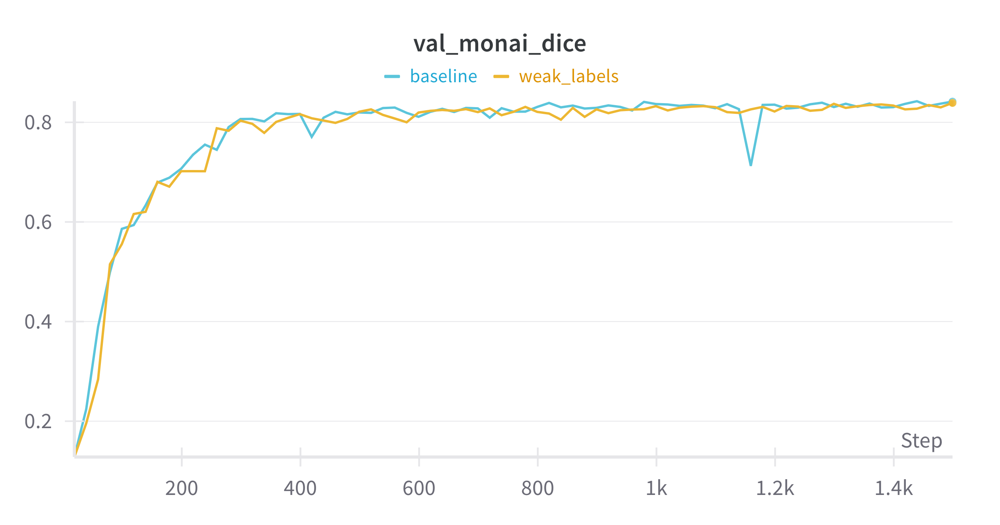

# TotalSegmentator Distillation

Use [TotalSegmentator](https://github.com/wasserth/TotalSegmentator) to create weak labels and train [btcv](https://www.synapse.org/Synapse:syn3193805).

Training is done with [monai](https://github.com/Project-MONAI/MONAI) wrapped in keras3 with pytorch backed.




### Create weak labels:
```bash
python create_weak_labels.py --data_dir RawData/Training/img --output_dir weak_labels/labels
```
### Training:

* baseline 
    ```bash
    python train.py --data_dir RawData/Training/img --wandb_run_name baseline --validation_labels RawData/Training/label --train_labels RawData/Training/label
    ```

* weak labels:
    ```bash
    train.py --data_dir RawData/Training/img --wandb_run_name weak_labels --validation_labels RawData/Training/label --train_labels weak_labels/labels/
    ```